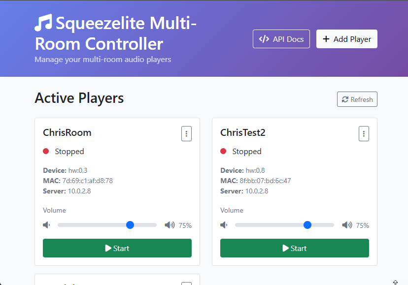

# Squeezelite Multi-Room Docker Controller



A Docker container that runs multiple [squeezelite](https://github.com/ralph-irving/squeezelite) players with a web-based management interface, designed for multi-room audio setups with USB DACs and other audio devices.

>[!CAUTION]
>This project is generated entirely by Claude AI, do not assume code has been verified/written by a competent coder.


## 🎵 Features

- **🏠 Multi-Room Support**: Create and manage multiple squeezelite players from a single container
- **🌐 Web Interface**: Clean, responsive web UI for player management with real-time status updates
- **🔌 USB DAC Support**: Automatic detection and configuration of USB DACs passed from the host
- **📱 Real-time Control**: Live status updates via WebSocket connections
- **💾 Persistent Configuration**: Player configurations survive container restarts
- **🎛️ Device Management**: Easy audio device selection and mapping
- **🔍 Auto-Discovery**: Automatic Music Assistant server discovery or manual configuration
- **🖥️ Cross-Platform**: Works on Linux, Windows (Docker Desktop), and WSL2

## DockerHub
[DockerHub Images](https://hub.docker.com/r/chrisuthe/squeezelitemultiroom)

## 📋 Prerequisites

### Linux (Recommended)
- Docker and Docker Compose installed
- Music Assistant server running on your network
- USB DACs or audio devices connected to the host system
- Linux host system (required for proper audio device access)

### Windows
- Docker Desktop for Windows with WSL2 backend
- Windows 10 version 2004+ or Windows 11
- PowerShell 5.1+ (for management scripts)
- **Note**: Audio device passthrough is limited on Windows. See [Windows Setup](#windows-setup) section.

## 🚀 Quick Start

### Linux

```bash
# 1. Clone the repository
git clone https://github.com/yourusername/squeezelite-docker.git
cd squeezelite-docker

# 2. Setup and build
chmod +x manage.sh
./manage.sh setup
./manage.sh build

# 3. Start the container
./manage.sh start

# 4. Access web interface
open http://localhost:8080
```

### Windows

```powershell
# 1. Clone the repository
git clone https://github.com/yourusername/squeezelite-docker.git
cd squeezelite-docker

# 2. Setup and build (PowerShell - recommended)
.\manage.ps1 setup
.\manage.ps1 build
.\manage.ps1 start

# Alternative: Using batch file
manage.bat setup
manage.bat build  
manage.bat start

# 3. Access web interface
start http://localhost:8080
```

### First Player Setup

1. **Open Web Interface**: Navigate to `http://localhost:8080`
2. **Add Player**: Click \"Add Player\" button
3. **Configure**:
   - **Name**: \"Living Room\" (or any unique name)
   - **Audio Device**: Select from auto-detected devices
   - **Music Assistant Server IP**: Leave empty for auto-discovery or enter server IP
   - **MAC Address**: Leave empty to auto-generate
4. **Create & Start**: Click \"Create Player\" then \"Start\"
5. **Verify**: Player should appear in your Music Assistant interface

## 🛠️ Management Commands

### Linux
```bash
./manage.sh start          # Start all services
./manage.sh stop           # Stop all services  
./manage.sh restart        # Restart all services
./manage.sh build          # Build Docker image
./manage.sh status         # Show service status
./manage.sh logs           # View logs
./manage.sh debug          # Run diagnostics
./manage.sh no-audio       # Start without audio devices (testing)
./manage.sh clean          # Clean up containers and images
```

### Windows
```powershell
# PowerShell
.\manage.ps1 start         # Start all services
.\manage.ps1 stop          # Stop all services
.\manage.ps1 restart       # Restart all services
.\manage.ps1 build         # Build Docker image
.\manage.ps1 build-minimal # Build with minimal dependencies (fallback)
.\manage.ps1 build-debug   # Diagnose build issues
.\manage.ps1 status        # Show service status
.\manage.ps1 logs          # View logs
.\manage.ps1 no-audio      # Start without audio devices (testing)
.\manage.ps1 clean         # Clean up containers and images

# Batch (alternative)
manage.bat start           # Same commands available
manage.bat build
manage.bat status
```

## 🔧 Detailed Setup

### Audio Device Configuration

Before running the container, ensure your USB DACs and audio devices are properly detected:

```bash
# Linux: List available audio devices
aplay -l

# Check device permissions
ls -la /dev/snd/

# Add user to audio group if needed
sudo usermod -a -G audio $USER
```

### Container Configuration

The system supports multiple Docker Compose configurations:

- **`docker-compose.yml`**: Standard mode with audio devices
- **`docker-compose.no-audio.yml`**: For environments without audio hardware
- **`docker-compose.windows.yml`**: Windows-specific configuration
- **`docker-compose.dev.yml`**: Development mode with live code reloading

### Environment Variables

Customize container behavior:

```yaml
environment:
  - SQUEEZELITE_SERVER_IP=192.168.1.100    # Default Music Assistant server
  - SQUEEZELITE_NAME_PREFIX=Docker         # Player name prefix
  - SQUEEZELITE_NO_AUDIO_OK=1             # Allow running without audio devices
  - WEB_PORT=8080                         # Web interface port
```

## 📖 Usage Guide

### Creating Players

1. **Web Interface**: Navigate to `http://<host-ip>:8080`
2. **Add Player**: Click \"Add Player\" button
3. **Configure Player**:
   - **Name**: Unique identifier (e.g., \"Kitchen\", \"Bedroom\")
   - **Audio Device**: Select from auto-detected devices:
     - `hw:X,Y` - Hardware devices (USB DACs, sound cards)
     - `default` - System default audio device
     - `null` - Silent device (for testing)
     - `dmix` - Software mixing device
   - **Server IP**: Music Assistant server (optional for auto-discovery)
   - **MAC Address**: Unique identifier (auto-generated if empty)

### Managing Players

- **Start/Stop**: Use buttons on each player card
- **Real-time Status**: Status indicators show running state with live updates
- **Delete**: Remove players you no longer need  
- **Device Selection**: Choose from automatically detected audio devices

### Audio Device Types

The system automatically detects:
- **USB DACs**: External digital-to-analog converters
- **Built-in Audio**: Motherboard audio cards
- **HDMI Audio**: HDMI output devices
- **Virtual Devices**: Software-based audio devices

## 🔍 API Reference

The application exposes a REST API for automation and integration:

### Endpoints

| Method | Endpoint | Description |
|--------|----------|-------------|
| `GET` | `/api/players` | List all players and their status |
| `POST` | `/api/players` | Create a new player |
| `DELETE` | `/api/players/<name>` | Delete a player |
| `POST` | `/api/players/<name>/start` | Start a player |
| `POST` | `/api/players/<name>/stop` | Stop a player |
| `GET` | `/api/players/<name>/status` | Get player status |
| `GET` | `/api/devices` | List available audio devices |

### Example Usage

```bash
# Create a new player
curl -X POST http://localhost:8080/api/players \\
  -H \"Content-Type: application/json\" \\
  -d '{\"name\": \"Kitchen\", \"device\": \"hw:1,0\", \"server_ip\": \"192.168.1.100\"}'

# Start a player
curl -X POST http://localhost:8080/api/players/Kitchen/start

# Get all players status
curl http://localhost:8080/api/players

# List available audio devices
curl http://localhost:8080/api/devices
```

## 🐛 Troubleshooting

### Common Issues

#### No Audio Devices Found
```bash
# Linux: Check if devices are accessible
docker run --rm -it --device /dev/snd:/dev/snd ubuntu:22.04 aplay -l

# Check permissions
sudo usermod -a -G audio $USER
# Logout and login again
```

#### Player Won't Start
- Verify audio device isn't in use by another application
- Check Music Assistant server is accessible: `ping <server-ip>`
- Review player logs in the web interface
- Try using \"null\" device for testing

#### Web Interface Not Accessible
```bash
# Check container status
docker-compose ps

# View logs
./manage.sh logs              # Linux
.\manage.ps1 logs            # Windows

# Check port conflicts
netstat -tlnp | grep 8080    # Linux
netstat -an | findstr 8080   # Windows
```

#### Build Failures (Windows)
```powershell
# Try minimal build
.\manage.ps1 build-minimal

# Diagnose issues
.\manage.ps1 build-debug

# Check Docker Desktop DNS settings:
# Docker Desktop → Settings → Docker Engine
# Add: {\"dns\": [\"8.8.8.8\", \"8.8.4.4\"]}
```

### Debug Commands

```bash
# Linux
./manage.sh debug           # Run comprehensive diagnostics
./manage.sh logs            # View application logs
docker-compose exec squeezelite-multiroom /bin/bash  # Shell access

# Windows  
.\manage.ps1 build-debug    # Diagnose build issues
.\manage.ps1 logs           # View application logs
docker-compose exec squeezelite-multiroom /bin/bash  # Shell access
```

### Testing Without Audio Hardware

For development, testing, or environments without audio devices:

```bash
# Start in no-audio mode
./manage.sh no-audio        # Linux
.\manage.ps1 no-audio       # Windows

# Create test players with \"null\" audio device
# Players will start successfully but produce no sound
```

## 🖥️ Windows Setup

### Docker Desktop Configuration

1. **Enable WSL2 Backend**:
   - Docker Desktop → Settings → General → \"Use WSL2 based engine\"

2. **Configure Resources**:
   - Go to Resources → Advanced
   - Allocate minimum 2GB RAM, 2+ CPU cores

3. **Network Settings**:
   - If builds fail, try: Resources → Network
   - Set DNS to: `8.8.8.8, 8.8.4.4`

### Audio Limitations on Windows

Docker on Windows has limited audio device passthrough. Alternatives:

1. **WSL2 Integration** (Recommended):
   ```bash
   # Install WSL2 Ubuntu
   wsl --install -d Ubuntu
   
   # Run container in WSL2 for better Linux compatibility
   ```

2. **Network Audio Streaming**:
   - Use Music Assistant's network audio features
   - Stream to network-attached audio devices
   - Configure Snapcast for synchronous multi-room audio

3. **Virtual Audio Devices**:
   - VB-Cable for Windows audio routing
   - VoiceMeeter for advanced audio mixing

### PowerShell Execution Policy

If you encounter script execution errors:

```powershell
# Enable script execution
Set-ExecutionPolicy -ExecutionPolicy RemoteSigned -Scope CurrentUser

# Or run with bypass
PowerShell -ExecutionPolicy Bypass -File .\\manage.ps1 setup
```

## 🏗️ Development

### Project Structure

```
squeezelite-docker/
├── 📄 README.md                    # This file
├── 📄 LICENSE                      # MIT License
├── 📄 requirements.txt             # Python dependencies
├── 🐳 Dockerfile                   # Main container build
├── 🐳 Dockerfile.minimal           # Minimal build (Windows fallback)
├── 🐳 docker-compose.yml           # Standard configuration
├── 🐳 docker-compose.no-audio.yml  # No audio devices
├── 🐳 docker-compose.windows.yml   # Windows-specific
├── 🐳 docker-compose.dev.yml       # Development mode
├── 🔧 supervisord.conf             # Process management
├── 🚀 entrypoint.sh                # Container startup script
├── 📁 app/                         # Flask application
│   ├── 🐍 app.py                   # Main application
│   ├── 🧪 health_check.py          # Container health validation
│   ├── 📁 templates/
│   │   └── 🌐 index.html           # Web interface
│   └── 📁 static/
│       └── 🎨 style.css            # Custom styles
├── 📁 config/                      # Persistent configuration
│   └── 📄 players.yaml.example     # Configuration example
├── 📁 logs/                        # Application logs
├── 🔧 manage.sh                    # Linux management script
├── 🔧 manage.ps1                   # Windows PowerShell script
├── 🔧 manage.bat                   # Windows batch script
└── 🔧 debug.sh                     # Debug utilities
```

### Building from Source

```bash
# Clone repository
git clone https://github.com/yourusername/squeezelite-docker.git
cd squeezelite-docker

# Development mode with live reloading
./manage.sh dev               # Linux
.\manage.ps1 dev             # Windows

# Manual Docker build
docker build -t squeezelite-multiroom .

# Custom build with options
docker build --build-arg SQUEEZELITE_VERSION=v1.9.9 -t my-squeezelite .
```

### Contributing

1. Fork the repository
2. Create a feature branch: `git checkout -b feature-name`
3. Make changes and test thoroughly
4. Submit a pull request

## 🔒 Security Considerations

- Container runs with minimal privileges
- Audio device access limited to necessary devices  
- No external network access beyond Music Assistant communication
- Configuration files stored securely in mounted volumes
- Web interface bound to localhost by default (change in production)

## 📊 Advanced Configuration

### Multiple Container Instances

Run multiple instances for different zones:

```yaml
# docker-compose.override.yml
version: '3.8'
services:
  squeezelite-zone1:
    extends:
      service: squeezelite-multiroom
    ports:
      - \"8081:8080\"
    volumes:
      - ./config-zone1:/app/config
      
  squeezelite-zone2:
    extends:
      service: squeezelite-multiroom  
    ports:
      - \"8082:8080\"
    volumes:
      - ./config-zone2:/app/config
```

### Production Deployment

For production use:

```yaml
# docker-compose.prod.yml
version: '3.8'
services:
  squeezelite-multiroom:
    restart: always
    logging:
      driver: \"json-file\"
      options:
        max-size: \"10m\"
        max-file: \"3\"
    environment:
      - FLASK_ENV=production
```

### Home Assistant Integration

```yaml
# configuration.yaml
sensor:
  - platform: rest
    resource: http://localhost:8080/api/players
    name: \"Squeezelite Players\"
    json_attributes:
      - players
      - statuses
    scan_interval: 30
```

## 🤝 Support and Contributing

- **Issues**: Report bugs and request features via GitHub Issues
- **Discussions**: Join community discussions for help and ideas
- **Pull Requests**: Contributions welcome! See development section
- **Documentation**: Help improve docs for better user experience

## 📄 License

This project is licensed under the MIT License - see the [LICENSE](LICENSE) file for details.

## 🙏 Credits and Acknowledgments

- **[Squeezelite](https://github.com/ralph-irving/squeezelite)** by Ralph Irving - The excellent audio player this project is built around
- **[Music Assistant](https://music-assistant.io/)** - Modern music library management and multi-room audio
- **Flask & SocketIO** - Web framework and real-time communication
- **Docker** - Containerization platform
- **Bootstrap** - Responsive web interface framework

---

<div align=\"center\">
  <b>🎵 Enjoy your multi-room audio setup! 🎵</b>
  <br>
  <sub>Built with ❤️ for the open-source community</sub>
</div>
